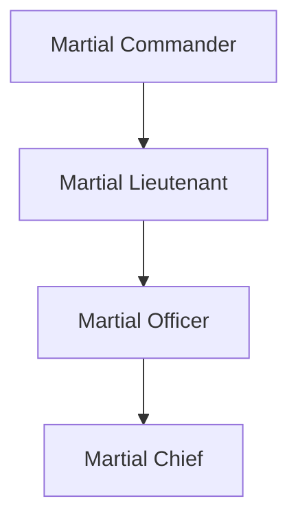

Martials are the lowest policing unit of the [[notes/dnd-notes/locations/Empire Of Sun|Empire]] that is assigned to all of the continents. They are deployed all over the continents to every major towns and all cities. Martials are mainly consist of humans, because of the nature of humans being racist towards all the other races than humans seeking any help from this group as a lawful unit is not something that a normal citizen believes in. Because of this they don't really get approached by normal citizens for any feuds. Their main objectives are fight against roaming monsters and arrest and eliminate any arcane users they find. The group had many encounters with them, most of them are unpleasant.

## Martial Power Structure

### Martial Officer
Officers are the most common and the lowest ranking officers in the organization. They are found in all around. 

### Martial Chief
Chief's are the rank higher of officers, They are deployed into popular towns and look over the deployment of officers inside of the town and the small villages and towns within their vicinity. They are also responsible for deployment of mobile units.

### Martial Lieutenant
Lieutenants are in charge of chiefs. They are deployed into all cities. The chief's of the nearby towns report to the lieutenants. There are two chiefs work under a lieutenant in a city. They are responsible for assignment of chiefs. 

### Martial Commander
Commanders are the highest ranking unit in the Martials. They overlook an entire continent. There are two commanders per a single continent and they overlook all operations. 